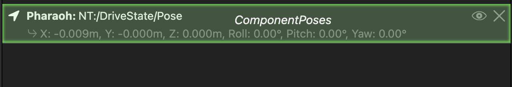
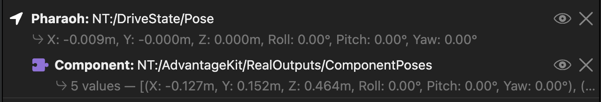

# FRC 78 AIR STRIKE 2026 Robot Code

## Simulating

To run the simulation from IntelliJ, use the `Build and Run Simulate Java` Run Configuration.

This will open up the Glass GUI.

Open AdvantageScope, and connect it to the sim:
`File > Connect To Simulator > Default: NetworkTables 4`.

Open a new 3D Field tab.

Add the robot pose to the 3D field by dragging the `DriveState > Pose` field into the **Poses**
table.

Add the simulated components by dragging `AdvantageKit > RealOutputs > ComponentPoses` field _onto_
the robot pose you added in the step above.

If you do it correctly, the components should be nested underneath the robot pose.

To add the 3d model, click `AdvantageScope > Use Custom Assets Folder` in the menu bar, then
navigate to the `assets` folder in the 2026-Bandit project.
When you click on the arrowhead next to the Pose entry, `Bandit` should appear in the list
