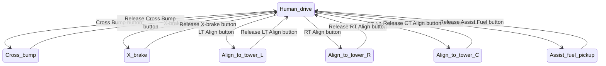

Swerve states

```mermaid
stateDiagram-v2
    Human_drive-->Cross_bump:Cross Bump button
    Human_drive-->X_brake:X-brake button
    Human_drive-->Align_to_tower_L:LT Align button
    Human_drive-->Align_to_tower_R:RT Align button
    Human_drive-->Align_to_tower_C:CT Align button
    Human_drive-->Assist_fuel_pickup:Assist Fuel button
    Cross_bump-->Human_drive:Release Cross Bump button
    X_brake-->Human_drive:Release X-brake button
    Assist_fuel_pickup-->Human_drive:Release Assist Fuel button
    Align_to_tower_L-->Human_drive:Release LT Align button
    Align_to_tower_R-->Human_drive:Release RT Align button
    Align_to_tower_C-->Human_drive:Release CT Align button
```