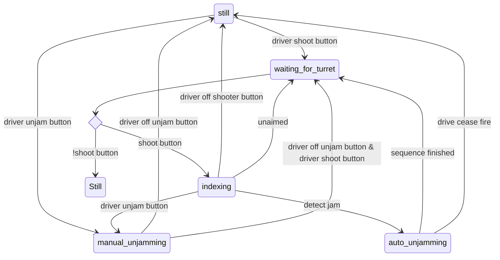

# Indexer states

## Spindexer

| State              | Spindexer | Feeder  |
|--------------------|-----------|---------|
| Still              | Off       | Off     |
| Waiting for Turret | Forward   | Off     |
| Indexing           | Forward   | Forward |
| Auto Unjamming     | Reverse   | Reverse |
| Manual Unjamming   | Reverse   | Reverse |

