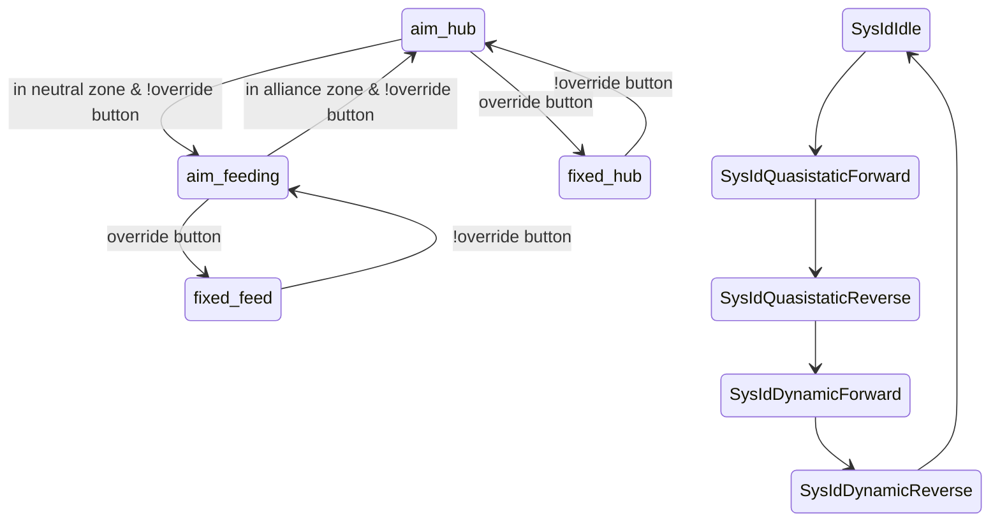
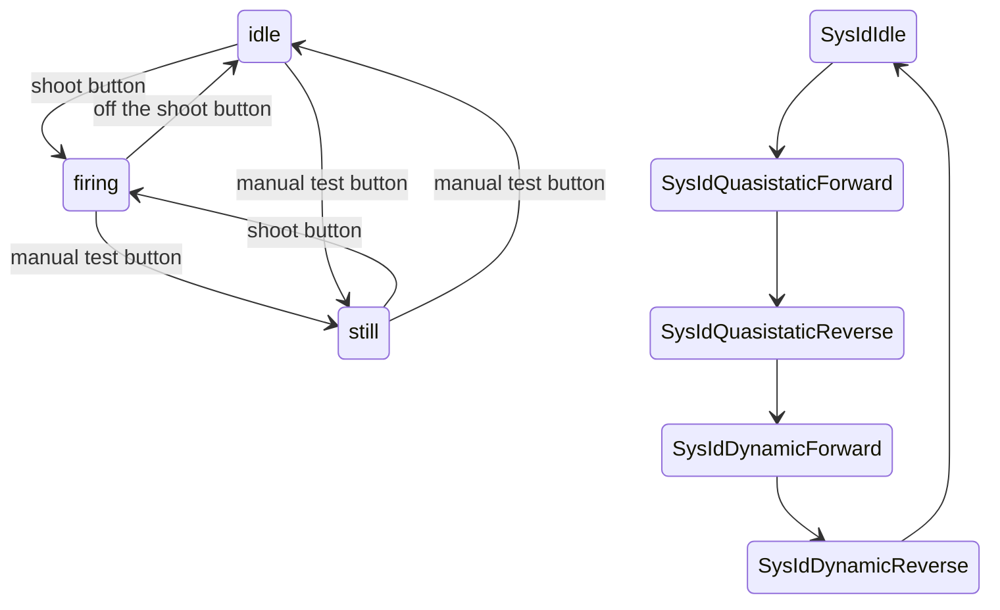

Aiming & Shooting States

Turret aim

```mermaid
stateDiagram-v2
    aim_hub --> aim_feeding: in neutral zone & !override button
    aim_feeding --> aim_hub: in alliance zone & !override button
    fixed_feed --> aim_feeding: !override button
    aim_feeding --> fixed_feed: override button
    aim_hub --> fixed_hub: override button
    fixed_hub --> aim_hub: !override button
    SysIdIdle --> SysIdQuasistaticForward
    SysIdQuasistaticForward --> SysIdQuasistaticReverse
    SysIdQuasistaticReverse --> SysIdDynamicForward
    SysIdDynamicForward --> SysIdDynamicReverse
    SysIdDynamicReverse --> SysIdIdle
```

Flywheel

```mermaid
stateDiagram-v2
    idle --> firing: shoot button
    firing --> idle: off the shoot button
    still --> firing: shoot button
    firing --> still: manual test button
    still --> idle: manual test button
    idle --> still: manual test button
    SysIdIdle --> SysIdQuasistaticForward
    SysIdQuasistaticForward --> SysIdQuasistaticReverse
    SysIdQuasistaticReverse --> SysIdDynamicForward
    SysIdDynamicForward --> SysIdDynamicReverse
    SysIdDynamicReverse --> SysIdIdle
```

